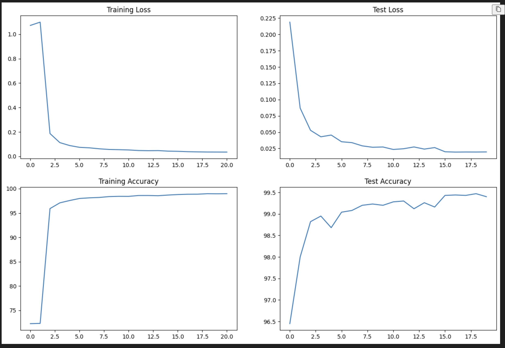

# ERA Session 5 :: MNIST Handwritten Digits Classifier

This project provides a machine learning model for the classification of handwritten digits using the famous MNIST dataset.

## Overview

The MNIST ("Modified National Institute of Standards and Technology") dataset is a large database of handwritten digits that is widely used for training and testing in the field of machine learning. It contains 60,000 training images and 10,000 testing images. Each image is a 28x28 grayscale image, associated with a label from 0 through 9.

Our classifier is a convolutional neural network (CNN) implemented using PyTorch.

Folder Structure

├── utils.py # Plotting, training and test functions

├── model.py # Model definition

└── S5.ipynb.py # Main python notebook file with usage scripts

└── README.md # This file

## Getting Started

1. **Clone the repository**:

   ```bash
   git clone https://github.com/janakg/era-s5.git

2. **Open the main Notebook in the Collab**

    ```bash
    https://colab.research.google.com/github/janakg/era-s5/blob/main/S5.ipynb

3. **For local modules, we load the Github repo by cloning or pulling the code**


## Training
Run for 20 epochs with LR of 0.01 and Batch size of 512

###Metrics
